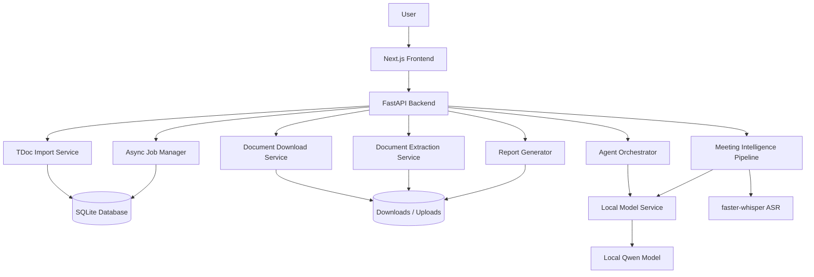
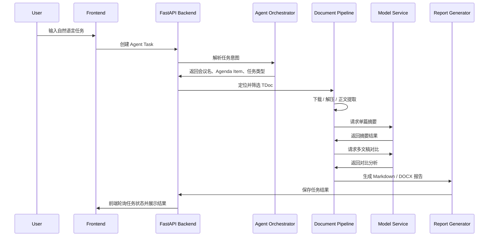
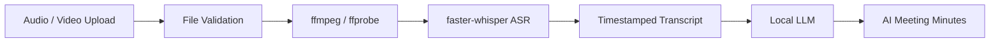

# 3GPP AI Document & Meeting Intelligence Platform

一个面向 **3GPP TDoc 文稿分析、跨文稿对比、会议转写与 AI 纪要生成** 的全栈 AI 工程项目。

本项目围绕真实标准化会议场景，构建从 **文稿导入、下载解压、正文提取、Agent 任务编排、本地模型摘要、跨文稿对比、会议转写到 AI 纪要生成** 的完整闭环，展示 AI 应用从产品界面到后端任务系统、从本地模型服务到多模态处理流水线的全栈工程能力。

---

## Overview

3GPP AI Document & Meeting Intelligence Platform 是一个面向标准化会议文稿与会议内容的 AI 工作台，能够将大量 3GPP TDoc 文稿和会议录音自动转化为结构化摘要、跨文稿对比报告和会议纪要，帮助用户更高效地理解复杂技术议题。

---

## Demo

> TODO: 在这里补充项目截图、运行 GIF 或视频链接。

### Example 1: Agent-driven TDoc Analysis

用户可以在 Agent 聊天页面输入自然语言任务：

```text
请帮我分析 TDoc_List_Meeting_SA2#174 中 AGENDA3 的文稿
```

系统自动完成：

1. 解析用户任务意图；
2. 定位目标会议清单；
3. 匹配对应 Agenda Item 下的 TDoc 文稿；
4. 下载原始文稿；
5. 自动解压 zip / 嵌套 zip；
6. 提取 PDF / DOCX / TXT / MD 正文；
7. 调用本地模型生成中文摘要；
8. 汇总生成单篇报告和 Agenda 总报告；
9. 在前端展示任务进度与最终结果。

### Example 2: Meeting Transcription and AI Minutes

用户上传会议音频或视频文件后，系统分两步处理：

1. **开始转写**：生成带时间戳的 transcript；
2. **生成 AI 纪要**：输出会议摘要、关键结论、待办事项和风险点。

### Screenshots

> TODO: 补充以下截图。

| Page | Screenshot |
|---|---|
| 文稿导入页 | TODO |
| 文稿列表 / Agenda 分组页 | TODO |
| Agent 聊天任务页 | TODO |
| 异步任务进度面板 | TODO |
| 单文稿摘要报告页 | TODO |
| 多文稿对比报告页 | TODO |
| 会议转写与 AI 纪要页 | TODO |

---

## Key Features

### 1. 3GPP TDoc 文稿导入与解析

- 支持导入 3GPP TDoc 清单文件；
- 支持 Excel 格式：`xlsx` / `xlsm`；
- 自动解析 TDoc 元数据；
- 自动提取文稿超链接；
- 按 `Agenda Item` 分组展示文稿；
- 支持后续批量下载与分析。

> TODO: 补充当前支持的 TDoc 清单字段，例如 TDoc Number、Title、Source、Agenda Item、Document URL 等。

### 2. 文稿自动下载、递归解压与正文提取

系统支持对原始文稿进行自动处理：

- 自动下载 TDoc 原始文件；
- 支持 zip 压缩包解压；
- 支持嵌套 zip 递归解压；
- 支持提取以下格式正文：
  - PDF；
  - DOCX；
  - TXT；
  - Markdown；
- 将正文内容统一交给模型服务进行摘要和分析。

### 3. 本地模型摘要与报告生成

项目通过独立部署的本地模型服务处理 AI 分析任务，包括：

- 单篇文稿中文摘要；
- 多文稿汇总；
- 同 Agenda 横向对比；
- 会议纪要生成；
- Markdown / DOCX 报告输出。

> TODO: 补充当前使用的 Qwen 模型版本，例如 Qwen2.5-7B-Instruct / Qwen2.5-14B-Instruct / 其他模型。

### 4. Agent 驱动的自然语言任务执行

用户不需要手动选择每个文稿，可以直接输入自然语言任务，例如：

```text
请帮我分析 SA2#174 中 Agenda 3 的所有文稿
```

Agent 工作流会自动完成：

- 任务意图识别；
- 会议清单定位；
- Agenda Item 匹配；
- 文稿筛选；
- 下载 / 解压 / 正文提取；
- 摘要生成；
- 报告汇总；
- 结果展示。

### 5. 同 Agenda 多文稿对比分析

针对同一 Agenda 下的多篇文稿，系统支持横向分析：

- 不同来源 / 公司 / 联系人之间的观点差异；
- 潜在共识；
- 潜在冲突；
- 重点关注文稿；
- 风险点与后续讨论方向。

### 6. 会议转写与 AI 纪要生成

系统支持上传会议音频或视频文件，并生成：

- 带时间戳 transcript；
- 会议整体摘要；
- 关键结论；
- 待办事项；
- 风险点；
- 后续跟进建议。

---

## Architecture

### System Architecture



### Module Description

| Module | Description |
|---|---|
| Frontend | 基于 Next.js + React + TypeScript + Tailwind CSS，负责文稿导入、浏览、Agent 聊天、任务进度和会议纪要展示 |
| Backend | 基于 FastAPI + SQLAlchemy + SQLite，负责 API、任务编排、文件管理、文稿处理和报告生成 |
| Model Service | 独立部署的本地模型服务，负责摘要、对比分析和会议纪要生成 |
| Document Pipeline | 负责 TDoc 下载、zip 解压、正文提取和缓存复用 |
| Meeting Pipeline | 负责音视频文件管理、ASR 转写和 AI 纪要生成 |
| Job System | 负责长耗时任务的异步执行、状态跟踪、失败重试和结果持久化 |

---

## Agent Workflow

Agent 工作流的目标是将用户的自然语言请求转化为可执行的多阶段任务。

### Workflow



### Task Stages

| Stage | Description |
|---|---|
| `PENDING` | 任务已创建，等待执行 |
| `PARSING_TASK` | 解析自然语言任务 |
| `LOCATING_DOCUMENTS` | 定位会议清单和 Agenda Item |
| `DOWNLOADING` | 下载原始文稿 |
| `EXTRACTING` | 解压并提取正文 |
| `SUMMARIZING` | 调用模型生成单篇摘要 |
| `COMPARING` | 生成多文稿对比分析 |
| `REPORTING` | 生成最终报告 |
| `COMPLETED` | 任务完成 |
| `FAILED` | 任务失败 |

> TODO: 根据你后端真实的 job status 字段修改上表。

---

## Document Processing Pipeline

文稿处理流水线负责将 3GPP TDoc 清单转化为可分析的结构化文本和报告。


### Pipeline Steps

| Step | Description |
|---|---|
| Excel Import | 读取 3GPP TDoc 清单文件 |
| Metadata Parsing | 解析 TDoc 编号、标题、来源、Agenda Item、链接等元数据 |
| Hyperlink Extraction | 从 Excel 单元格中提取原始文稿下载链接 |
| Agenda Grouping | 按 Agenda Item 对文稿进行分组 |
| Download | 自动下载原始文稿 |
| Recursive Unzip | 支持 zip 和嵌套 zip 解压 |
| Text Extraction | 提取 PDF / DOCX / TXT / MD 正文 |
| Summary | 调用本地模型生成中文摘要 |
| Report Generation | 输出 Markdown / DOCX 分析报告 |

### Supported File Types

| File Type | Status | Tool |
|---|---|---|
| `.xlsx` | Supported | openpyxl |
| `.xlsm` | Supported | openpyxl |
| `.zip` | Supported | zipfile |
| Nested `.zip` | Supported | zipfile |
| `.pdf` | Supported | PyMuPDF |
| `.docx` | Supported | python-docx |
| `.txt` | Supported | built-in text parser |
| `.md` | Supported | built-in text parser |

> TODO: 如果支持 `.pptx`、`.doc`、扫描版 PDF OCR，后续可以补充。

---

## Meeting Intelligence Pipeline

会议智能模块采用 “ASR 转写 + LLM 纪要生成” 的两阶段流水线。



### Stage 1: Transcription

系统接收会议音频或视频文件，调用 `faster-whisper` 生成带时间戳的 transcript。

输出示例：

```json
[
  {
    "start": 0.0,
    "end": 5.2,
    "text": "Today we will discuss the progress of Agenda Item 3..."
  },
  {
    "start": 5.2,
    "end": 12.8,
    "text": "Several companies submitted TDocs related to this issue..."
  }
]
```

### Stage 2: AI Minutes Generation

基于 transcript，模型服务生成结构化会议纪要：

- 会议摘要；
- 关键结论；
- 待办事项；
- 风险点；
- 后续跟进建议。

> TODO: 补充支持的音视频格式，例如 `.mp3`、`.wav`、`.m4a`、`.mp4`。

---

## Tech Stack

### Frontend

- Next.js
- React
- TypeScript
- Tailwind CSS

### Backend

- FastAPI
- SQLAlchemy
- SQLite
- openpyxl
- requests / httpx

### Document Processing

- PyMuPDF
- python-docx
- zipfile

### Speech-to-Text

- faster-whisper
- ffmpeg
- ffprobe

### LLM Service

- transformers
- torch
- accelerate
- local Qwen model

### Report Generation

- Markdown
- DOCX

> TODO: 补充 DOCX 报告生成具体使用的库，例如 `python-docx`。

---

## Quick Start

> TODO: 根据你的实际启动方式确认以下命令。

### 1. Clone Repository

```bash
git clone <TODO: your-repository-url>
cd <TODO: your-repository-name>
```

### 2. Start Backend

```bash
cd 3gpp-tdoc-backend

python -m venv .venv
source .venv/bin/activate

pip install -r requirements.txt

uvicorn app.main:app --reload --host 0.0.0.0 --port 8000
```

Backend will be available at:

```text
http://localhost:8000
```

API docs:

```text
http://localhost:8000/docs
```

### 3. Start Model Service

```bash
cd model_service

python -m venv .venv
source .venv/bin/activate

pip install -r requirements.txt

python app.py
```

Model service will be available at:

```text
http://localhost:TODO
```

> TODO: 补充模型服务端口，例如 `8001`、`9000` 等。

### 4. Start Frontend

```bash
cd 3gpp-tdoc-frontend

npm install
npm run dev
```

Frontend will be available at:

```text
http://localhost:3000
```

### 5. Environment Variables

Backend `.env` example:

```env
DATABASE_URL=sqlite:///./data/app.db
UPLOAD_DIR=./uploads
DOWNLOAD_DIR=./downloads
MODEL_SERVICE_URL=http://localhost:TODO
REQUEST_TIMEOUT_SECONDS=TODO
MAX_RETRY_TIMES=TODO
```

Model Service `.env` example:

```env
MODEL_NAME_OR_PATH=TODO
DEVICE=cuda
DTYPE=auto
MAX_NEW_TOKENS=TODO
```

> TODO: 根据项目真实配置补充 `.env.example`。

---

## API Examples

> TODO: 以下接口路径是建议写法，请根据你实际 FastAPI 路由修改。

### 1. Import TDoc List

```http
POST /api/v1/tdocs/import
Content-Type: multipart/form-data
```

Request:

```bash
curl -X POST "http://localhost:8000/api/v1/tdocs/import" \
  -F "file=@TDoc_List_Meeting_SA2_174.xlsx"
```

Response:

```json
{
  "meeting_id": 1,
  "filename": "TDoc_List_Meeting_SA2_174.xlsx",
  "total_documents": 128,
  "agenda_items": ["3", "4", "5"]
}
```

### 2. List Documents by Agenda Item

```http
GET /api/v1/tdocs?meeting_id=1&agenda_item=3
```

Response:

```json
{
  "meeting_id": 1,
  "agenda_item": "3",
  "documents": [
    {
      "tdoc_number": "S2-xxxxxx",
      "title": "TODO",
      "source": "TODO",
      "url": "TODO",
      "status": "pending"
    }
  ]
}
```

### 3. Create Agent Task

```http
POST /api/v1/agent/tasks
Content-Type: application/json
```

Request:

```json
{
  "message": "请帮我分析 TDoc_List_Meeting_SA2#174 中 AGENDA3 的文稿"
}
```

Response:

```json
{
  "job_id": "TODO",
  "status": "PENDING"
}
```

### 4. Query Job Status

```http
GET /api/v1/jobs/{job_id}
```

Response:

```json
{
  "job_id": "TODO",
  "status": "SUMMARIZING",
  "progress": 65,
  "message": "正在生成文稿摘要",
  "result_url": null
}
```

### 5. Generate Meeting Transcript

```http
POST /api/v1/meetings/transcribe
Content-Type: multipart/form-data
```

Request:

```bash
curl -X POST "http://localhost:8000/api/v1/meetings/transcribe" \
  -F "file=@meeting.mp4"
```

Response:

```json
{
  "job_id": "TODO",
  "status": "PENDING"
}
```

### 6. Generate AI Meeting Minutes

```http
POST /api/v1/meetings/{meeting_id}/minutes
```

Response:

```json
{
  "job_id": "TODO",
  "status": "PENDING"
}
```

---

## Example Reports

> TODO: 用真实或脱敏后的项目输出替换下面的示例内容。

### Single Document Summary

```markdown
# TDoc Summary: S2-xxxxxx

## Basic Information

- TDoc Number: S2-xxxxxx
- Title: TODO
- Source: TODO
- Agenda Item: 3

## Summary

本文稿主要讨论了 TODO。文稿提出 TODO，并指出当前方案在 TODO 方面仍存在问题。

## Key Points

1. TODO
2. TODO
3. TODO

## Potential Impact

该文稿可能影响 Agenda 3 下关于 TODO 的后续讨论，尤其是在 TODO 和 TODO 方面。

## Follow-up Questions

- TODO
- TODO
```

### Agenda-level Comparison Report

```markdown
# Agenda 3 Multi-document Comparison Report

## Overview

本报告汇总分析 Agenda 3 下的多篇 TDoc 文稿，重点关注不同来源之间的观点差异、潜在共识和冲突点。

## Consensus

- 多篇文稿均关注 TODO。
- 不同来源普遍认为 TODO 是当前阶段需要解决的问题。
- 多数文稿倾向于在 TODO 方向上继续推进。

## Differences

| Source | Main Proposal | Key Difference |
|---|---|---|
| Company A | TODO | TODO |
| Company B | TODO | TODO |
| Company C | TODO | TODO |

## Potential Conflicts

- Company A 的方案强调 TODO，而 Company B 更关注 TODO。
- 部分文稿在 TODO 定义上存在差异。
- 关于 TODO 的处理方式尚未形成明确共识。

## High-priority Documents

| TDoc | Reason |
|---|---|
| S2-xxxxxx | 提出了关键方案 |
| S2-yyyyyy | 对现有方案提出反对意见 |
| S2-zzzzzz | 总结了多个相关问题 |

## Recommendations

- 优先阅读 S2-xxxxxx 和 S2-yyyyyy；
- 重点关注 TODO 相关争议；
- 在后续会议中确认 TODO 的定义和边界。
```

### Meeting Minutes

```markdown
# AI Meeting Minutes

## Meeting Summary

本次会议主要围绕 TODO 展开讨论，与会者重点讨论了 TODO、TODO 和 TODO。

## Key Decisions

1. TODO
2. TODO
3. TODO

## Action Items

| Owner | Task | Due Date |
|---|---|---|
| TODO | TODO | TODO |
| TODO | TODO | TODO |

## Risks

- TODO
- TODO
- TODO

## Timeline Highlights

| Time | Content |
|---|---|
| 00:00:00 | 会议开始，介绍议题 |
| 00:05:30 | 讨论 TODO |
| 00:18:20 | 对 TODO 形成初步结论 |
```

---

## Engineering Highlights

### 1. Agent Workflow Orchestration

本项目不是简单的 “上传文本 → 调用模型 → 返回结果”，而是围绕真实任务构建多阶段 Agent 工作流：

```text
自然语言任务
→ 任务解析
→ 会议清单定位
→ Agenda 文稿筛选
→ 下载 / 解压 / 正文提取
→ 模型摘要 / 对比分析
→ 报告生成
→ 前端展示
```

该设计使用户可以用接近自然语言的方式触发复杂批处理任务。

### 2. Decoupled Model Serving

模型服务与业务后端解耦，后端通过统一 HTTP 接口调用独立模型服务。

优势：

- 业务后端不直接依赖具体模型实现；
- 便于替换不同模型；
- 便于后续迁移到 vLLM / Ollama / OpenAI-compatible API；
- 模型服务可以单独扩容或部署到 GPU 节点；
- 摘要、对比、纪要等能力可以统一封装。

### 3. Async Job Architecture

文稿下载、正文提取、模型摘要和会议转写都属于长耗时任务，因此项目采用异步任务架构。

支持能力：

- 任务创建；
- 状态持久化；
- 前端轮询；
- 进度展示；
- 失败状态记录；
- 结果文件保存。

> TODO: 补充你实际使用的异步实现方式，例如 FastAPI BackgroundTasks、Celery、asyncio、线程池或自定义 Job Manager。

### 4. Robust Fallback Design

项目在多个阶段设计了工程回退逻辑：

- 已有摘要缓存复用，避免重复调用模型；
- 文稿处理失败时记录失败原因，不阻塞其他文稿；
- 模型调用超时时可降级为轻量摘要；
- 多文稿对比失败时可回退为基础汇总报告；
- 下载失败可进行重试；
- zip 解压失败可保留原始文件并记录错误。

> TODO: 补充当前已经实现的 fallback 逻辑，未完成的可以移动到 Roadmap。

### 5. Document Processing Robustness

3GPP TDoc 文稿存在多种复杂情况：

- Excel 超链接格式不统一；
- 文稿可能以 zip 形式提供；
- zip 中可能包含嵌套 zip；
- 同一 Agenda 下文稿数量较多；
- PDF / DOCX / TXT / MD 格式混合；
- 部分文稿正文过长，需要截断或分块处理；
- 模型摘要过程可能超时。

本项目通过统一的文档处理流水线降低了这些工程复杂度。

### 6. Speech + LLM Pipeline

会议场景采用两阶段流水线：

```text
Audio / Video
→ faster-whisper ASR
→ Timestamped Transcript
→ Local LLM
→ AI Meeting Minutes
```

该设计将语音识别和大模型纪要生成解耦，便于分别优化转写质量和纪要质量。

---

## Feature Status

> TODO: 根据真实实现状态修改。

| Feature | Status | Notes |
|---|---|---|
| TDoc Excel 导入 | TODO: Done / In Progress | 支持 xlsx / xlsm |
| TDoc 元数据解析 | TODO | 解析标题、来源、Agenda 等 |
| Excel 超链接提取 | TODO | 提取原始文稿 URL |
| Agenda Item 分组 | TODO | 按议题展示文稿 |
| 文稿自动下载 | TODO | 支持批量下载 |
| zip 解压 | TODO | 支持普通 zip |
| 嵌套 zip 解压 | TODO | 支持递归处理 |
| PDF 正文提取 | TODO | PyMuPDF |
| DOCX 正文提取 | TODO | python-docx |
| TXT / MD 正文提取 | TODO | 文本解析 |
| 本地模型摘要 | TODO | local Qwen model |
| 多文稿对比 | TODO | 同 Agenda 横向分析 |
| Markdown 报告生成 | TODO | 单篇 / 总报告 |
| DOCX 报告生成 | TODO | TODO |
| Agent 聊天任务 | TODO | 自然语言触发任务 |
| 异步任务进度 | TODO | 前端轮询 |
| 会议音视频上传 | TODO | TODO |
| faster-whisper 转写 | TODO | 带时间戳 transcript |
| AI 会议纪要生成 | TODO | 摘要、结论、行动项 |
| 缓存复用 | TODO | 避免重复摘要 |
| 失败重试 | TODO | 下载 / 模型调用 |
| 超时控制 | TODO | 模型服务 / 请求 |

---

## Roadmap

### Short-term

- [ ] 补充 README 截图和 Demo GIF；
- [ ] 增加 `.env.example`；
- [ ] 增加 Docker Compose 一键启动；
- [ ] 完善任务状态流转；
- [ ] 增加真实样例报告；
- [ ] 完善错误日志和失败原因展示；
- [ ] 增加文稿处理统计信息。

### Mid-term

- [ ] 支持更复杂的 TDoc 查询与筛选；
- [ ] 支持多会议、多 Agenda 的横向对比；
- [ ] 支持更长文档的 chunk-based 摘要；
- [ ] 支持 OCR 处理扫描版 PDF；
- [ ] 支持更多模型后端，例如 vLLM / Ollama；
- [ ] 增加报告导出模板；
- [ ] 增加会议纪要编辑与人工校对功能。

### Long-term

- [ ] 构建面向 3GPP 标准会议的长期知识库；
- [ ] 支持跨会议议题追踪；
- [ ] 支持公司 / 来源 / 联系人维度的观点演化分析；
- [ ] 支持基于历史文稿的趋势分析；
- [ ] 支持 RAG 问答与引用定位；
- [ ] 支持多人协作与权限管理。

---

## Repository Structure

```text
3gpp-tdoc-backend/
├── app/
│   ├── api/v1/
│   ├── core/
│   ├── models/
│   ├── schemas/
│   ├── services/
│   └── main.py
├── data/
├── uploads/
├── downloads/
└── .env

model_service/
├── app.py
├── summarizer.py
└── requirements.txt

3gpp-tdoc-frontend/
├── app/
│   ├── documents/
│   ├── chat/
│   ├── meetings/
│   └── layout.tsx
├── components/
│   ├── chat/
│   ├── jobs/
│   └── meetings/
└── lib/
```

### Directory Description

| Path | Description |
|---|---|
| `3gpp-tdoc-backend/app/api/v1/` | FastAPI 路由定义 |
| `3gpp-tdoc-backend/app/core/` | 配置、数据库、通用工具 |
| `3gpp-tdoc-backend/app/models/` | SQLAlchemy 数据模型 |
| `3gpp-tdoc-backend/app/schemas/` | Pydantic 请求与响应结构 |
| `3gpp-tdoc-backend/app/services/` | 文稿导入、下载、解析、任务编排、报告生成等核心服务 |
| `3gpp-tdoc-backend/data/` | SQLite 数据库与中间数据 |
| `3gpp-tdoc-backend/uploads/` | 用户上传文件 |
| `3gpp-tdoc-backend/downloads/` | 下载后的 TDoc 原始文件与解压内容 |
| `model_service/` | 独立本地模型服务 |
| `3gpp-tdoc-frontend/app/` | Next.js App Router 页面 |
| `3gpp-tdoc-frontend/components/` | 前端 UI 组件 |
| `3gpp-tdoc-frontend/lib/` | 前端 API client 与工具函数 |

> TODO: 根据真实目录补充或删除不一致的部分。

---

## Evaluation Metrics

> TODO: 建议后续补充这部分，这会让项目在比赛和简历中更有说服力。

| Metric | Value |
|---|---|
| 单次可处理 TDoc 数量 | TODO |
| 单篇 PDF 平均正文提取耗时 | TODO |
| 单篇摘要平均耗时 | TODO |
| Agenda 批处理平均耗时 | TODO |
| 缓存命中后节省时间 | TODO |
| 会议转写速度 | TODO |
| 支持最大音频时长 | TODO |
| 模型服务平均响应时间 | TODO |
| 文稿处理成功率 | TODO |

---

## Limitations

当前项目仍有以下限制：

- 对扫描版 PDF 的支持有限；
- 长文档摘要效果依赖截断或分块策略；
- 本地模型推理速度依赖 GPU 环境；
- 多文稿对比质量依赖输入文稿正文提取质量；
- 会议转写准确率受音频质量、口音和背景噪声影响；
- 当前使用 SQLite，更适合原型系统，生产环境建议迁移到 PostgreSQL。

> TODO: 根据实际情况调整限制说明。

---

## License

TODO: 补充许可证，例如 MIT License。

---

## Author

TODO: 补充作者信息。

```text
Name: TODO
Email: TODO
GitHub: TODO
```
