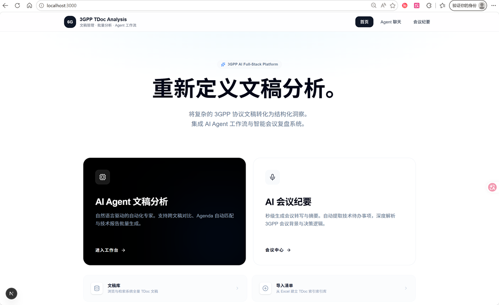
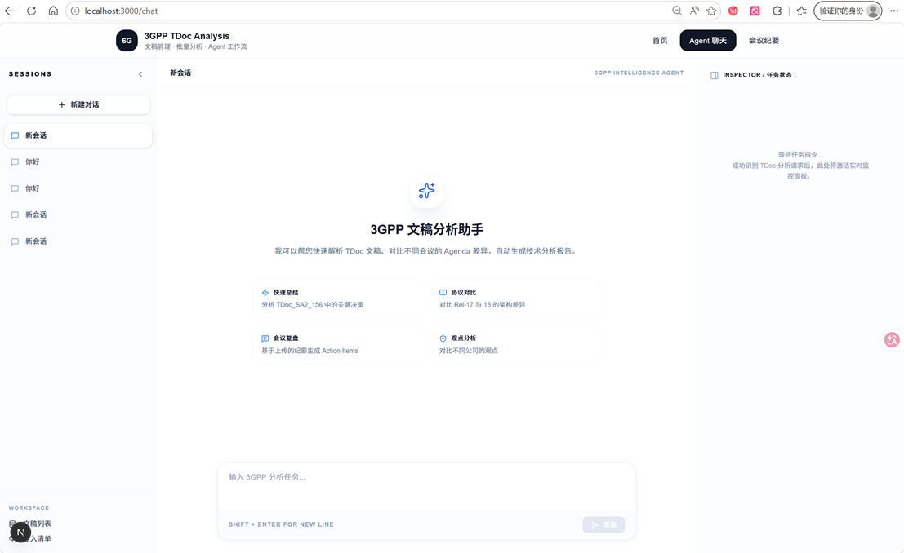
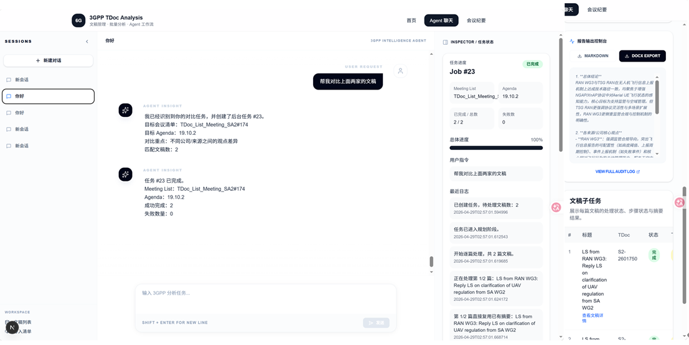
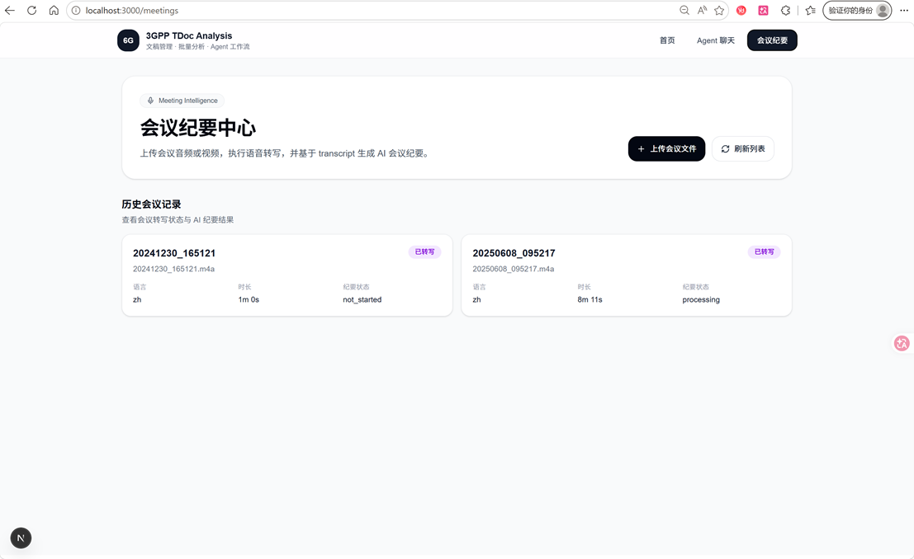
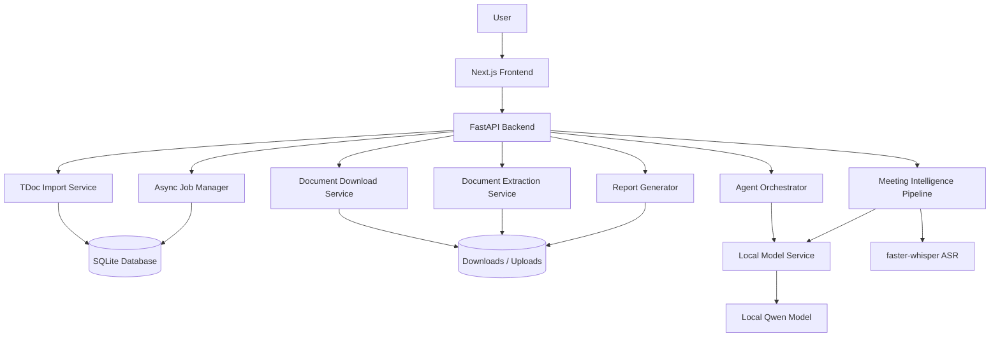
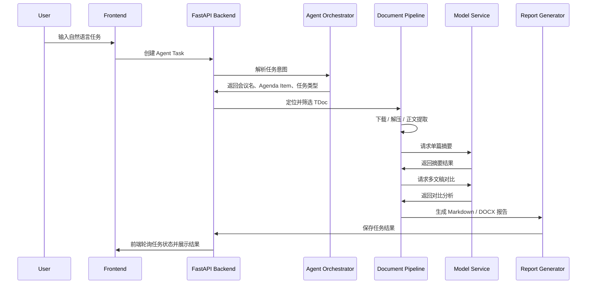
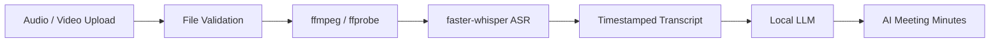

# 3GPP AI Document & Meeting Intelligence Platform

一个面向 **3GPP TDoc 文稿分析、跨文稿对比、会议转写与 AI 纪要生成** 的全栈 AI 工程项目。

---

## Motivation

3GPP 标准化会议通常会产生大量文稿。这些文稿数量多、格式复杂、来源分散，并且经常按照不同的 Agenda Item 组织。对于学习者、研究人员和标准跟踪人员来说，手动下载、整理、阅读和对比这些文稿成本很高。尤其是在分析某个具体技术议题时，往往需要同时理解多篇文稿之间的观点差异、潜在共识和争议点。

本项目的创作动机正是来源于这一真实需求：希望通过 AI 工程化手段，将 3GPP 文稿的获取、解析、摘要、对比和报告生成流程自动化，降低标准文稿学习与会议跟踪的门槛。

因此，本项目构建了一个面向 3GPP 标准化场景的 AI 文稿与会议智能平台，围绕 **Agent 任务编排、文稿解析、本地模型服务、语音转写和前端交互** 形成完整闭环，展示从产品界面到模型调用、从异步任务到结果交付的 AI 全栈工程能力。

---

## Overview

**3GPP AI Document & Meeting Intelligence Platform** 是一个面向 **3GPP 通信标准化会议文稿与会议内容** 的 AI 工作台，能够将大量 3GPP TDoc 文稿和会议录音自动转化为结构化摘要、跨文稿对比报告和会议纪要，帮助用户更高效地理解复杂技术议题。

## Demo



### Example 1: Agent-driven TDoc Analysis



用户可以在 Agent 聊天页面输入自然语言任务：

```text
请帮我分析 TDoc_List_Meeting_SA2#174 中 AGENDA3 的文稿
```

在该流程中，Agent 不只是简单地调用一次大模型，而是作为任务编排器，根据用户意图动态调用不同工具，完成从“任务解析”到“结果交付”的完整链路：

1. **任务理解工具**：解析用户输入，识别任务类型、目标会议和 Agenda Item；
2. **会议定位工具**：在已导入的 TDoc 清单中定位目标会议文件；
3. **文稿筛选工具**：根据 Agenda Item 匹配对应的 TDoc 文稿集合；
4. **下载工具**：批量下载原始 TDoc 文稿文件；
5. **解压工具**：自动处理 zip / 嵌套 zip 压缩包；
6. **正文提取工具**：从 PDF / DOCX / TXT / MD 中提取可分析文本；
7. **模型摘要工具**：调用本地模型服务，为单篇文稿生成中文摘要；
8. **对比分析工具**：对同一 Agenda 下的多篇文稿进行横向分析，提取共识、差异和潜在冲突；
9. **报告生成工具**：汇总生成单篇报告、Agenda 总报告以及可下载结果；
10. **状态同步工具**：将任务进度和最终结果同步到前端页面展示。



### Example 2: Meeting Transcription and AI Minutes

用户上传会议音频或视频文件后，系统分两步处理：

1. **开始转写**：生成带时间戳的 transcript；
2. **生成 AI 纪要**：输出会议摘要、关键结论、待办事项和风险点。


---

## Architecture

### System Architecture


```mermaid
flowchart TD
    User[User] --> Frontend[Next.js Frontend]

    Frontend --> Backend[FastAPI Backend]

    Backend --> ImportService[TDoc Import Service]
    Backend --> DownloadService[Document Download Service]
    Backend --> ExtractService[Document Extraction Service]
    Backend --> AgentService[Agent Orchestrator]
    Backend --> JobService[Async Job Manager]
    Backend --> ReportService[Report Generator]
    Backend --> MeetingService[Meeting Intelligence Pipeline]

    ImportService --> DB[(SQLite Database)]
    DownloadService --> Storage[(Downloads / Uploads)]
    ExtractService --> Storage
    JobService --> DB
    ReportService --> Storage

    AgentService --> ModelService[Local Model Service]
    MeetingService --> ASR[faster-whisper ASR]
    MeetingService --> ModelService

    ModelService --> LocalLLM[Local Qwen Model]
```

### Module Description

| Module | Description |
|---|---|
| Frontend | 基于 Next.js + React + TypeScript + Tailwind CSS，负责文稿导入、浏览、Agent 聊天、任务进度和会议纪要展示 |
| Backend | 基于 FastAPI + SQLAlchemy + SQLite，负责 API、任务编排、文件管理、文稿处理和报告生成 |
| Model Service | 独立部署的本地模型服务，负责摘要、对比分析和会议纪要生成 |
| Document Pipeline | 负责 TDoc 下载、zip 解压、正文提取和缓存复用 |
| Meeting Pipeline | 负责音视频文件管理、ASR 转写和 AI 纪要生成 |
| Job System | 负责长耗时任务的异步执行、状态跟踪、失败重试和结果持久化 |

---

## Agent Workflow

Agent 工作流的目标是将用户的自然语言请求转化为可执行的多阶段任务。

### Workflow


```mermaid
sequenceDiagram
    participant U as User
    participant F as Frontend
    participant B as FastAPI Backend
    participant A as Agent Orchestrator
    participant D as Document Pipeline
    participant M as Model Service
    participant R as Report Generator

    U->>F: 输入自然语言任务
    F->>B: 创建 Agent Task
    B->>A: 解析任务意图
    A->>B: 返回会议名、Agenda Item、任务类型
    B->>D: 定位并筛选 TDoc
    D->>D: 下载 / 解压 / 正文提取
    D->>M: 请求单篇摘要
    M->>D: 返回摘要结果
    D->>M: 请求多文稿对比
    M->>D: 返回对比分析
    D->>R: 生成 Markdown / DOCX 报告
    R->>B: 保存任务结果
    B->>F: 前端轮询任务状态并展示结果
```
---
### Task Stages

| Stage | Description |
|---|---|
| `PENDING` | 任务已创建，等待执行 |
| `PARSING_TASK` | 解析自然语言任务 |
| `LOCATING_DOCUMENTS` | 定位会议清单和 Agenda Item |
| `DOWNLOADING` | 下载原始文稿 |
| `EXTRACTING` | 解压并提取正文 |
| `SUMMARIZING` | 调用模型生成单篇摘要 |
| `COMPARING` | 生成多文稿对比分析 |
| `REPORTING` | 生成最终报告 |
| `COMPLETED` | 任务完成 |
| `FAILED` | 任务失败 |

### Supported File Types

| File Type | Support Status | Processing Tool |
|---|---|---|
| `.xlsx` | Supported | `openpyxl` |
| `.xlsm` | Supported | `openpyxl` |
| `.zip` | Supported | `zipfile` |
| Nested `.zip` | Supported | `zipfile` |
| `.pdf` | Supported | `PyMuPDF` |
| `.docx` | Supported | `python-docx` |
| `.txt` | Supported | Built-in text parser |
| `.md` | Supported | Built-in text parser |

---

## Meeting Intelligence Pipeline

会议智能模块采用 **ASR 转写 + LLM 纪要生成** 的两阶段流水线，将会议音频或视频文件转化为带时间戳的 transcript，并进一步生成结构化 AI 会议纪要。


```mermaid
flowchart LR
    A["Audio / Video Upload"] --> B["File Validation"]
    B --> C["ffmpeg / ffprobe"]
    C --> D["faster-whisper ASR"]
    D --> E["Timestamped Transcript"]
    E --> F["Local LLM"]
    F --> G["AI Meeting Minutes"]
```
### Stage 1: Transcription

系统接收会议音频或视频文件，调用 `faster-whisper` 生成带时间戳的 transcript。

输出示例：

```json
[
  {
    "start": 0.0,
    "end": 5.2,
    "text": "Today we will discuss the progress of Agenda Item 3..."
  },
  {
    "start": 5.2,
    "end": 12.8,
    "text": "Several companies submitted TDocs related to this issue..."
  }
]
```

### Stage 2: AI Minutes Generation

基于 transcript，模型服务生成结构化会议纪要：

- 会议摘要；
- 关键结论；
- 待办事项；
- 风险点；
- 后续跟进建议。

---

## Tech Stack

### Frontend

- Next.js
- React
- TypeScript
- Tailwind CSS

### Backend

- FastAPI
- SQLAlchemy
- SQLite
- openpyxl
- requests / httpx

### Document Processing

- PyMuPDF
- python-docx
- zipfile

### Speech-to-Text

- faster-whisper
- ffmpeg
- ffprobe

### LLM Service

- transformers
- torch
- accelerate
- local Qwen model

### Report Generation

- Markdown
- DOCX

---

## Quick Start

### 1. Clone Repository

```bash
git clone git@github.com:ZIYER-LL/3GPP-Document-analysis.git
cd 3GPP-Document-analysis
```

### 2. Start Backend

cd 3gpp-tdoc-backend

pip install -r requirements.txt

uvicorn app.main:app --host 0.0.0.0 --port 8000

### 3. Start Model Service

cd model_service

pip install -r requirements.txt

uvicorn app:app --host 0.0.0.0 --port 9000

### 4. Start Frontend

cd 3gpp-tdoc-frontend

npm install
npm run dev

---

### Mid-term

- [ ] 支持更复杂的 TDoc 查询与筛选；
- [ ] 支持多会议、多 Agenda 的横向对比；
- [ ] 支持更长文档的 chunk-based 摘要；
- [ ] 支持 OCR 处理扫描版 PDF；
- [ ] 支持更多模型后端，例如 vLLM / Ollama；
- [ ] 增加报告导出模板；
- [ ] 增加会议纪要编辑与人工校对功能。

### Long-term

- [ ] 构建面向 3GPP 标准会议的长期知识库；
- [ ] 支持跨会议议题追踪；
- [ ] 支持公司 / 来源 / 联系人维度的观点演化分析；
- [ ] 支持基于历史文稿的趋势分析；
- [ ] 支持 RAG 问答与引用定位；
- [ ] 支持多人协作与权限管理。

---

## Repository Structure

```text
3gpp-tdoc-backend/
├── app/
│   ├── api/v1/
│   ├── core/
│   ├── models/
│   ├── schemas/
│   ├── services/
│   └── main.py
├── data/
├── uploads/
├── downloads/
└── .env

model_service/
├── app.py
├── summarizer.py
└── requirements.txt

3gpp-tdoc-frontend/
├── app/
│   ├── documents/
│   ├── chat/
│   ├── meetings/
│   └── layout.tsx
├── components/
│   ├── chat/
│   ├── jobs/
│   └── meetings/
└── lib/
```

### Directory Description

| Path | Description |
|---|---|
| `3gpp-tdoc-backend/app/api/v1/` | FastAPI 路由定义 |
| `3gpp-tdoc-backend/app/core/` | 配置、数据库、通用工具 |
| `3gpp-tdoc-backend/app/models/` | SQLAlchemy 数据模型 |
| `3gpp-tdoc-backend/app/schemas/` | Pydantic 请求与响应结构 |
| `3gpp-tdoc-backend/app/services/` | 文稿导入、下载、解析、任务编排、报告生成等核心服务 |
| `3gpp-tdoc-backend/data/` | SQLite 数据库与中间数据 |
| `3gpp-tdoc-backend/uploads/` | 用户上传文件 |
| `3gpp-tdoc-backend/downloads/` | 下载后的 TDoc 原始文件与解压内容 |
| `model_service/` | 独立本地模型服务 |
| `3gpp-tdoc-frontend/app/` | Next.js App Router 页面 |
| `3gpp-tdoc-frontend/components/` | 前端 UI 组件 |
| `3gpp-tdoc-frontend/lib/` | 前端 API client 与工具函数 |

---

## Limitations

当前项目仍有以下限制：

- 对扫描版 PDF 的支持有限；
- 长文档摘要效果依赖截断或分块策略；
- 本地模型推理速度依赖 GPU 环境；
- 多文稿对比质量依赖输入文稿正文提取质量；
- 会议转写准确率受音频质量、口音和背景噪声影响；
- 当前使用 SQLite，更适合原型系统，生产环境应迁移到 PostgreSQL。

---

## Author

```text
Name: ziyer
Email: 484256597@qq.com
GitHub: https://github.com/ZIYER-LL
```
